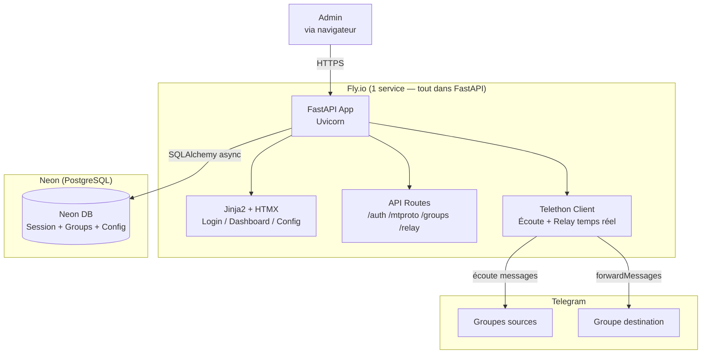
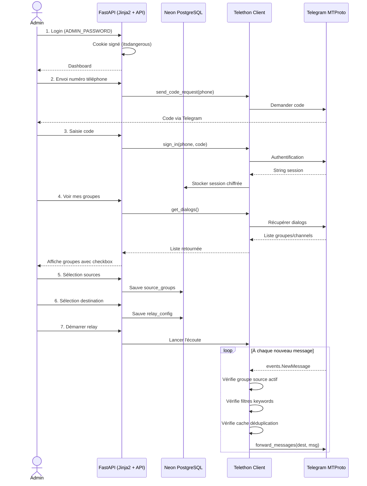
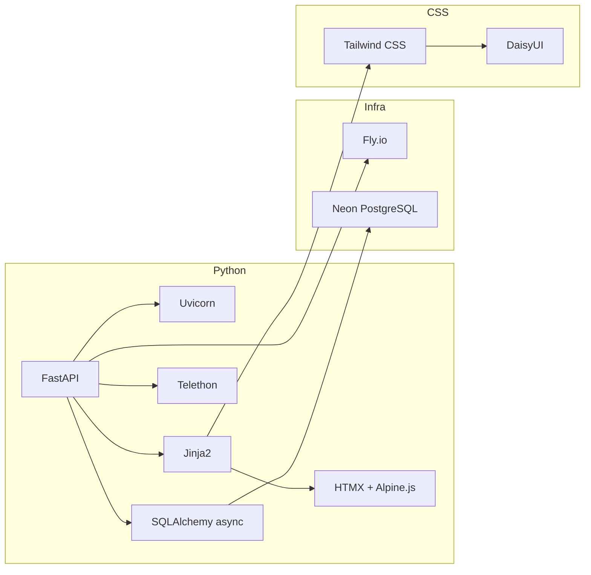
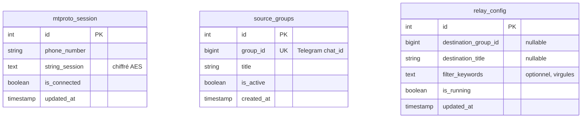
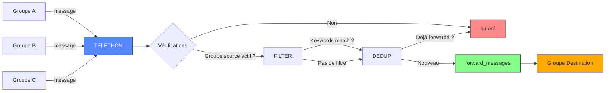
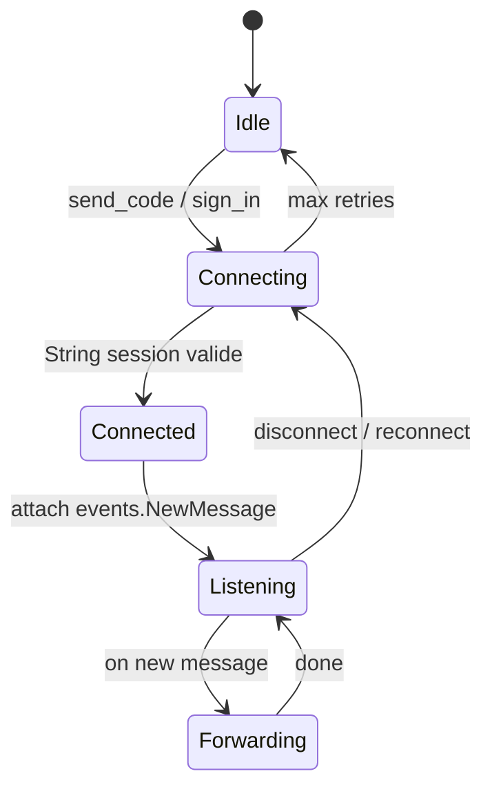
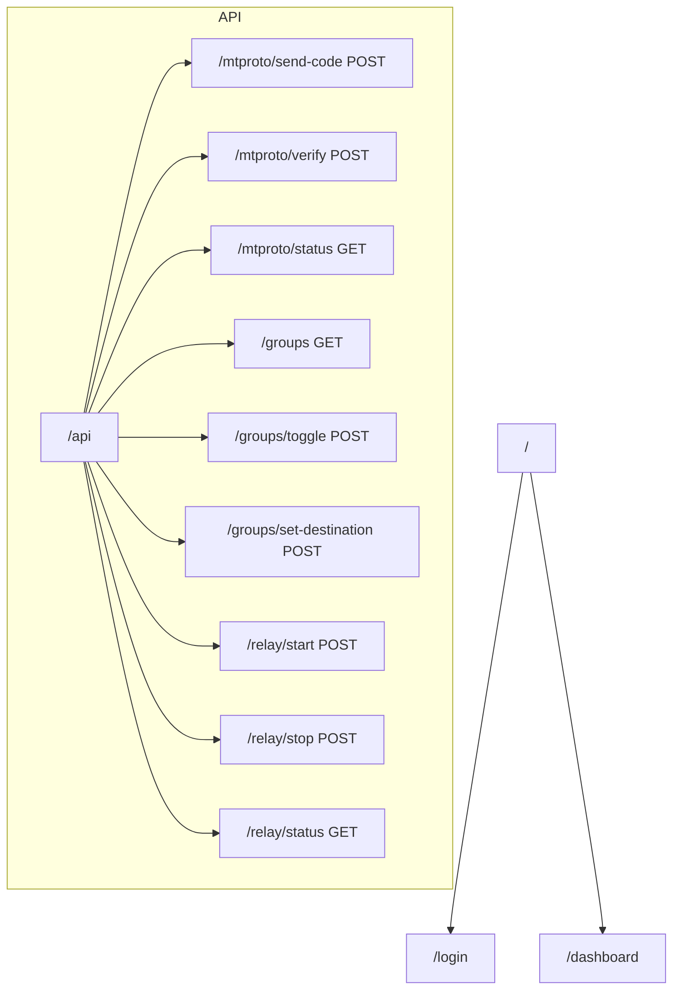

# Schéma d'architecture — Trade

## 1. Architecture globale



---

## 2. Workflow complet



---

## 3. Stack technique



---

## 4. Modèle de données (DB)



---

## 5. Flux des données (runtime)



---

## 6. Structure du projet

```
trade/
├── app/
│   ├── main.py                 # App FastAPI + lifespan
│   ├── config.py               # Settings (ADMIN_PASSWORD, DB, API_ID, etc.)
│   ├── routes/
│   │   ├── __init__.py
│   │   ├── auth.py             # /login, /logout
│   │   ├── mtproto.py          # /api/mtproto/send-code, /verify
│   │   ├── groups.py           # /api/groups, /toggle
│   │   └── relay.py            # /api/relay/start, /stop
│   ├── templates/
│   │   ├── base.html           # Layout global
│   │   ├── login.html          # Page login
│   │   └── dashboard.html      # Page principale
│   ├── db/
│   │   ├── __init__.py
│   │   ├── engine.py           # Engine SQLAlchemy async
│   │   └── models.py           # Définitions des tables
│   ├── telegram/
│   │   ├── __init__.py
│   │   ├── client.py           # Connexion Telethon
│   │   └── relay.py            # Event handler + forwarding
│   └── static/
│       └── css/                # Tailwind output si build local
├── pyproject.toml
├── uv.lock
├── .env.example
├── Dockerfile
├── fly.toml
└── README.md
```

---

## 7. Telethon — cœur du relay



---

## 8. Déploiement

| Service | Rôle | Plan |
|---------|------|------|
| **Fly.io** | FastAPI + Telethon (tout-en-un) | Free tier (3 VMs always-on) |
| **Neon** | PostgreSQL (config) | Free tier (0.5GB) |

---

## 9. Arbre des routes


